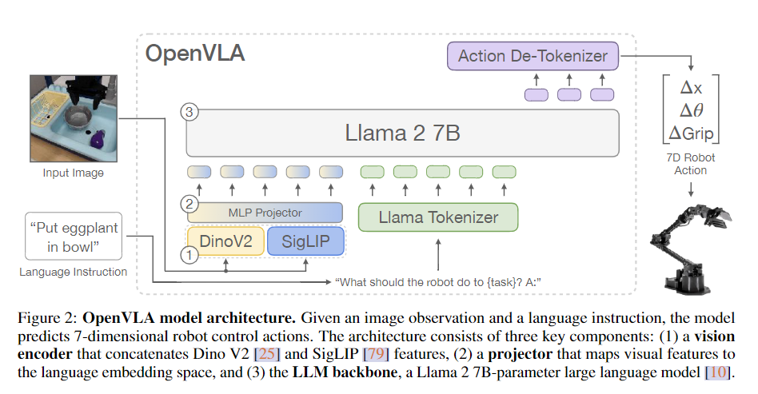

# OpenVLA

## 论文基本信息

- **论文标题**: OpenVLA: An Open-Source Vision-Language-Action Model
- **作者**: Moo Jin Kim, Karl Pertsch, Siddharth Karamcheti, Ted Xiao, Ashwin Balakrishna, Suraj Nair, Rafael Rafailov, Ethan Foster, Grace Lam, Pannag Sanketi, Quan Vuong, Thomas Kollar, Benjamin Burchfiel, Russ Tedrake, Dorsa Sadigh, Sergey Levine, Percy Liang, Chelsea Finn
- **发表时间**: 2024年6月
- **论文链接**: [https://arxiv.org/abs/2406.09246](https://arxiv.org/abs/2406.09246)
- **项目网站**: [https://openvla.github.io/](https://openvla.github.io/)

### Todolist 阅读标题、作者、摘要，写一句话总结论文

- [X] 阅读 Introduction，标出研究动机和主要贡献
- [X] 画出 OpenVLA 的整体结构框架（视觉-语言-动作流程）
- [X] 精读模型部分（Section 3），理解每个模块作用与结构
- [ ] 梳理视觉编码器（DINOv2, SigLIP）和语言模型（Llama2）的集成方式
- [X] 精读训练与推理部分（3.2~3.4），记录输入输出与 loss 构成
- [ ] 精读实验部分（Section 4），记录关键图表和性能对比
- [ ] 写出论文的3个创新点和可能的局限性
- [ ] 写一段“如何在组会上介绍这篇论文”的内容
- [ ] 写一段“OpenVLA 和我的研究有什么关系”
- [ ] 整理最终精读笔记，完成结构化输出

interested paper:

1. Sigmoid Loss for Language Image Pre-Training
2. RT-2: Vision-Language-Action Models Transfer Web Knowledge to Robotic Control

OpenVLA builds on a Llama 2 language model combined with a visual encoder that fuses pretrained features from DINOv2 and SigLIP

**challenge:** while vision or language model has robustness to face unseen situation, robotic manipulation policies failed to operating on novel conditions.

**solution:** using vison and language model as foundation generalize objects
and scenes

**issues:** closed model, uneasy to deploying and adapting, high cost of gpus

-> openval: small paremeter, low cost, easy to deploy and finetune

recent model of vlms consists of three parts, namely: (1) a visual encoder (2) a projector which take the out put of the visual encoder and map them to the space of language model (3) a llm backbone

openval (1) tow-part visual encoder SigLIP and DinoV2 (2) 2-layer MLP projector (3) Llama 2

represent the actions in the space of LLM by mapping continuous robot actions to the discrete tokens
Using quantiles instead of the min-max bounds
overwriting the 256 least used tokens in the Llama tokenizer's vocabulary (which corresponds to the last 256 tokens) with our action tokens.

- 使用了 Open X-Embodiment + BridgeData v2
- 总计约97万个真实机器人演示，覆盖22种机器人平台和多个任务
- 每个数据样本：图像帧 + 动作向量 + 自然语言指令
- 动作数据均为真实机器人数据，而非模拟数据
- LLM：Llama 2-7B，因开源、参数较小、适合本地部署
- 视觉编码器：SigLIP + DINOv2 双重编码，融合两种表征能力（CLIP-like & DINO-like）
- 将视觉特征投影至语言模型空间，通过两层MLP
- 使用 frozen 特征（预训练 encoder 不参与训练），减少计算负担
- 训练策略：

  - 使用 Cross-Entropy loss，预测离散化后的动作 token 序列
  - 替换 Llama 2 的 256 个不常用 token，以容纳动作 token
- 模型训练方式：

  - 冻结 Llama 2 和视觉 encoder，仅训练投影器和 LoRA 层
  - 支持 consumer-level GPU 微调（推理和微调开销较低）

## 研究背景

OpenVLA是一个开源的视觉-语言-动作（Vision-Language-Action，VLA）模型，旨在改变我们教授机器人新技能的方式。该模型在互联网规模的视觉-语言数据和多样化的机器人演示数据上进行预训练，使得我们可以通过微调这样的模型来获得稳健、可泛化的视觉运动控制策略，而不是从头开始训练新的行为。

### 研究动机

现有的VLA模型面临两个主要挑战：

- 现有的VLA模型大多是封闭的，公众无法访问
- 先前的工作未能探索如何有效地微调VLA模型以适应新任务，这是广泛采用的关键组成部分

OpenVLA正是为了解决这些问题而提出的。

## 核心思想

### 模型架构

OpenVLA是一个7B参数的开源VLA模型，基于以下组件构建：

1. **基础语言模型**: 使用Llama 2语言模型
2. **视觉编码器**: 融合了来自DINOv2和SigLIP的预训练特征
3. **训练数据**: 在97万个真实世界的机器人演示集合上进行训练

### 与传统方法的区别

OpenVLA与其他模型（如RT-2-X）的主要区别在于：

- 参数量更少（7B vs 55B），但性能更好
- 完全开源，便于研究社区使用和改进
- 支持在消费级GPU上进行高效微调
- 通过量化技术实现高效部署

## 算法详解

### 模型结构

[待填写具体的模型结构细节]

### 训练方法

[待填写训练方法细节]

### 微调技术

OpenVLA可以通过现代低秩适应方法在消费级GPU上进行微调，并通过量化技术高效部署，而不会降低下游任务的成功率。

## 实验结果

### 实验设置

- **任务**: 29个不同的机器人操作任务
- **机器人平台**: 多种机器人实施
- **基线算法**: RT-2-X (55B参数)和Diffusion Policy等

### 性能比较

OpenVLA在以下方面表现优于基线算法：

1. **任务成功率**:

   - 与RT-2-X相比，绝对任务成功率提高了16.5%
   - 与Diffusion Policy相比，在多任务环境中表现提高了20.4%
2. **泛化能力**:

   - 在涉及多个对象的多任务环境中表现尤为出色
   - 具有强大的语言理解能力
3. **计算效率**:

   - 参数量是RT-2-X的1/7
   - 可以在消费级GPU上进行微调
   - 通过量化技术实现高效部署

## 关键见解

通过对OpenVLA论文的精读，我得到了以下关键见解：

[待填写关键见解]

## 潜在应用

OpenVLA模型可能在以下领域有潜在应用：

- **家庭服务机器人**: 通过语言指令控制机器人完成日常任务
- **工业自动化**: 提高工厂机器人的灵活性和适应性
- **医疗辅助**: 辅助医疗机器人执行精确操作
- **教育机器人**: 创建能够与学生互动的教育机器人

## 局限性与未来工作

[待填写局限性与未来工作]

## 学习笔记

### 重要概念

- **视觉-语言-动作模型(VLA)**: 结合视觉、语言和动作能力的AI模型
- **微调(Fine-tuning)**: 在预训练模型基础上针对特定任务进行调整
- **低秩适应(Low-rank adaptation)**: 一种高效的模型微调方法
- **量化(Quantization)**: 减少模型参数精度以提高推理效率的技术

### 疑问与思考

[待填写疑问与思考]

### 个人理解

[在这里记录你对论文的个人理解和见解]

## 参考资料

1. [OpenVLA论文](https://arxiv.org/abs/2406.09246)
2. [OpenVLA项目网站](https://openvla.github.io/)
3. [相关工作: RT-2-X]
4. [相关工作: Diffusion Policy]

---

*注：本文是我对OpenVLA论文的学习笔记，将随着学习的深入不断更新和完善。*
