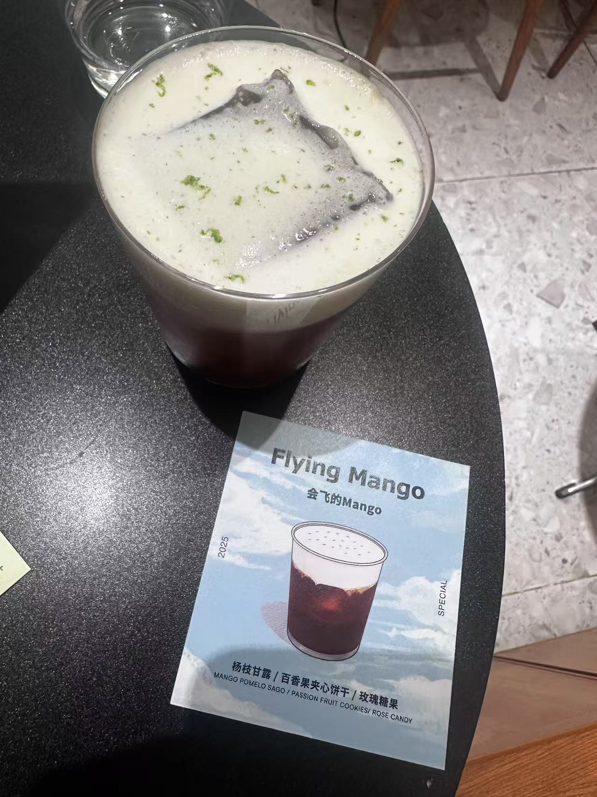

## 建站

github action部署 theme需要使用submodule

## 美化

修改 根目录下的 _config.butterfly.yml ,图片有专门的一栏在前面可以统一设置,img放在themes里面的source img下

## 社交账号链接

设置中的图标，是基于 [Font Awesome 图标库]() 的, 链接了 github, twitter, email, 小红书

## 添加图片

踩了个天坑,关于图像有两个包,分别是 hexo-asset-img 和 hexo-generator-image, image这个包会链接到根目录,导致图片无法访问

```
INFO  Start processing
update link as:-->/.io//airpot_shanghai.jpg
update link as:-->/.io//airpot_shanghai.jpg
INFO  Hexo is running at http://localhost:4000/ . Press Ctrl+C to stop.
```

查了好久才发现
我的思路一开始以为是我的语法错误,按照网上差到的一直乱试,没有结果
```



```
> 我觉得这里我犯了第一个错误 终端其实一直有提示link as:-->/.io//airpot_shanghai.jpg,直接说明了链接到的根目录,我没有发现

接下来尝试的是各种ai 无果,其中openai提出可以查看一下网络抓包,通过网络抓包我发现路径错误的问题


后来还是openai提示说是包进行的链接,然后我想到排插包的问题,因为我记得我一开始想使用另外一个主题 对包进行过一些安转删除可能出问题,我尝试直接复制package文件给openai,无果,(然后windsurf其实一直有读取权限但是没有发现问题),然后用指令读取npm包,发现这两个包冲突的问题

```
# arthur @ Arthur in E:\Develop\ArthurWANGZHE.github.io on git:main [14:26:18]
$ npm ls --depth=0
hexo-site@0.0.0 E:\Develop\ArthurWANGZHE.github.io
├── hexo-asset-image@1.0.0
├── hexo-asset-img@1.2.0
├── hexo-generator-archive@2.0.0
├── hexo-generator-category@2.0.0
├── hexo-generator-index@4.0.0
├── hexo-generator-tag@2.0.0
├── hexo-renderer-ejs@2.0.0
├── hexo-renderer-marked@7.0.1
├── hexo-renderer-pug@3.0.0
├── hexo-renderer-stylus@3.0.1
├── hexo-server@3.0.0
├── hexo-theme-landscape@1.1.0
└── hexo@7.3.0
```

然后实际上openai也不知道要使用哪个
```
# arthur @ Arthur in E:\Develop\ArthurWANGZHE.github.io on git:main [14:26:21]
$ npm uninstall hexo-asset-image hexo-asset-img
> npm install hexo-asset-image@latest --save
> 

removed 22 packages, and audited 263 packages in 3s

35 packages are looking for funding
  run `npm fund` for details

found 0 vulnerabilities

added 21 packages, and audited 284 packages in 3s

35 packages are looking for funding
  run `npm fund` for details

6 vulnerabilities (1 moderate, 4 high, 1 critical)

Some issues need review, and may require choosing
a different dependency.

Run `npm audit` for details.
(kaggle )
```
最后尝试确定是需要使用

```
# arthur @ Arthur in E:\Develop\ArthurWANGZHE.github.io on git:main [14:29:13]
$ npm install hexo-asset-img --save
```